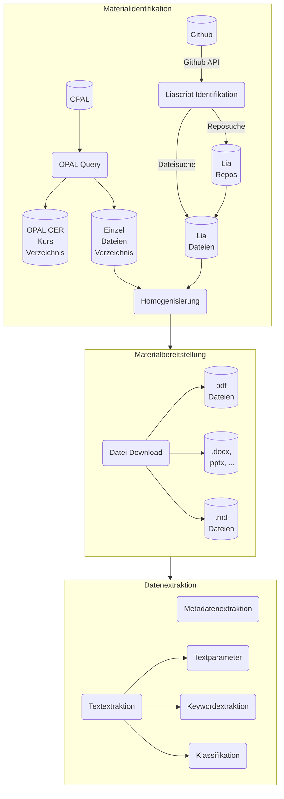

# Connected Lectures

Aggregation von OER Meta-Daten aus unterschiedlichen Lehr-Lern-Materialien sächsischer Hochschulen

```mermaid
flowchart TD

    classDef someclass fill:#f96
    
    subgraph Materialidentifikation
    OPAL[(OPAL)] --> OPAL_QUERY(OPAL Query)
    OPAL_QUERY --> OPAL_REPOS[(OPAL OER\nKurs\nVerzeichnis)]
    OPAL_QUERY --> OPAL_FILES[(Einzel\nDateien\nVerzeichnis)]
    GITHUB[(Github)] --> |Github API| LIA_IDENT(Liascript Identifikation)
    LIA_IDENT --> |Dateisuche| LIA_FILES[(Lia\nDateien)]
    LIA_REPOS --> LIA_FILES
    LIA_IDENT --> |Reposuche| LIA_REPOS[(Lia\nRepos)]
    LIA_FILES --> DB_HOMOGENISIERUNG(Homogenisierung)
    OPAL_FILES--> DB_HOMOGENISIERUNG 
    end

    subgraph Materialbereitstellung
    FILE_DOWNLOAD(Datei Download)
    FILE_DOWNLOAD --> PDFS[(pdf\n Dateien)]
    FILE_DOWNLOAD --> OFFICE[(.docx,\n.pptx, ...)]
    FILE_DOWNLOAD --> MD[(.md\n Dateien)]
    end

    subgraph Datenextraktion
    METADATENEXTRAKTION(Metadatenextraktion)
   
    TEXTEXTRAKTION(Textextraktion)
    TEXTEXTRAKTION --> TEXTPARAMETER(Textparameter)
    TEXTEXTRAKTION --> KEYWORDEXTRAKTION(Keywordextraktion)
    TEXTEXTRAKTION --> KLASSIFIKATION(Klassifikation)
    end

    DB_HOMOGENISIERUNG -->  Materialbereitstellung
    Materialbereitstellung --> Datenextraktion
```
