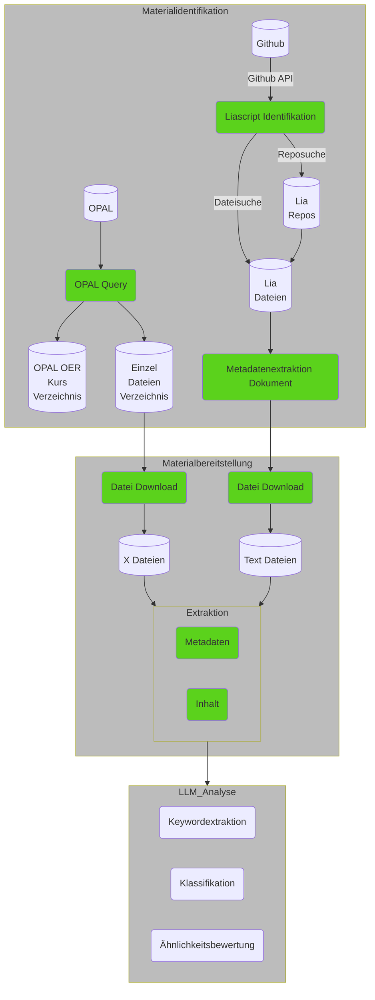

# Connected Lectures

## Motivation 

Lehrende generieren ihre eigenen Materialien eher individuell. Kontakte und ein Austausch zwischen Lehrenden mit gleichen Lehrinhalten sind ausgesprochen selten – eine echte Übernahme von Materialien umso mehr. Entsprechend werden an jeder Hochschule mit einem immensen Aufwand individuelle Vorlesungen jeweils neu erstellt, anstatt grundlegende Elemente zu teilen und gemeinsam weiterzuentwickeln.

Das Projekt „OER - Connected Lecturers“ (OER-CL) zielt darauf ab, Lehrende in Sachsen, die mit Open Educational Resources (OER) arbeiten, zu vernetzen und die Identifikation von Materialien und potenziellen Kollaborationspartnern zu erleichtern. Um dieses Problem zu adressieren, entwickelt OER-CL einen Prototypen zur automatischen Erfassung und Anreicherung von Metadaten (z.B. Autor:innen, Hochschule, Titel) sowie zur inhaltlichen Erschließung durch Schlüsselworte und bibliografische Klassifikation von OER-Dokumenten. Diese Informationen werden mittels Semantic-Web-Technologien verarbeitet. Der Ansatz ermöglicht die strukturierte Vernetzung von Daten über das Web hinweg und erleichtern so die Wiederauffindbarkeit und Nutzbarkeit von Informationen in einem globalen Kontext. OER-Dokumente lassen sich damit semantisch sinnvoll verknüpfen und Ähnlichkeitsanalysen zwischen den Inhalten durchführen.

Zur automatischen Verschlagwortung soll maschinelles Lernen genutzt werden, um ein kontrolliertes Vokabular für die Klassifikation der Inhalte zu nutzen und weiterzuentwickeln, da das erforderliche Fachwissen vom OER-Autoren nicht vorausgesetzt werden kann. Diese Techniken verbessern die Präzision der Metadatenerfassung und -vernetzung.

Beide Kernaspekte des Projekts – die Inhaltserschließung und das Empfehlungssystem – werden in einer Studie mit den beteiligten Lehrenden evaluiert. Die Umsetzung erfolgt in enger Zusammenarbeit zwischen dem Institut für Informatik und der Universitätsbibliothek der Bergakademie.

Das Vorhaben wird durch den [AK E-Learning](https://bildungsportal.sachsen.de/portal/parentpage/institutionen/arbeitskreis-e-learning-der-lrk-sachsen/) Sachsen gefördert.

## Realisierung 

Das Projekt gliedert sich in 3 Subbereiche - [Materialidentifikation](https://github.com/TUBAF-IFI-ConnectedLecturer/Materialidentifikation), Materialbereitstellung, Textanalyse und Clustering. Dabei werden zwei Felder von OER Aktivitäten - Lehrmaterialien aus dem OPAL LMS und der Beschreibungssprache LiaScript - untersucht.

